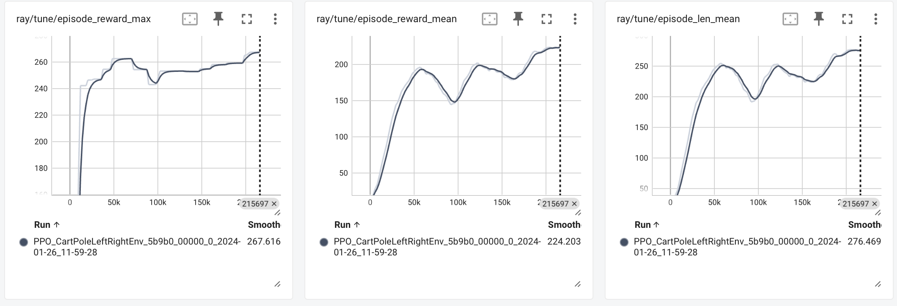
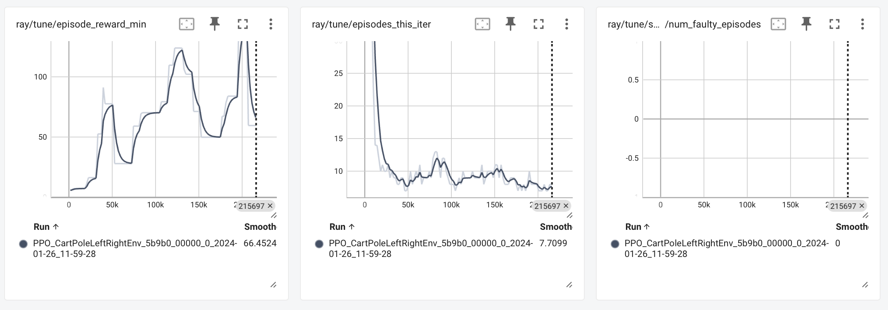
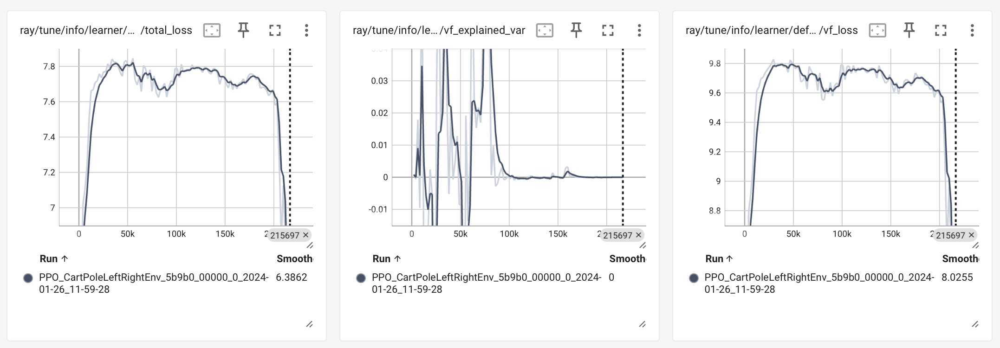

# CartPole Left Right Task and Report

## Task Description

The task is called CartPole Left Right. You need to change classic CartPole environment in such a wat that it will have a goal (0 or 1) and Cart should balance the Pole in correspond sides of platform (0 - left, 1 - right). The goal implementation is already provided for you. The main goal is to implement reward function that will help agent to do this.

## Reward Function

The provided reward function adjusts the reward based on the position of the Cart relative to the desired side of the platform.

```python
if not done:
    if goal == 0:
        # Reward for balancing on the left side
        reward = 1.0 - 0.1 * abs(x - (-2.4))
    else:
        # Reward for balancing on the right side
        reward = 1.0 - 0.1 * abs(x - 2.4)
```

## Video Demonstration
<video width="630" height="300" src="https://github.com/kdeviatiarova/evolcomp/blob/9d78612f28b6d10712e77b3b8e7ca3aef79005ea/rl_task_cartpole/rendered_video.mp4"></video>


## TensorBoard Plots




